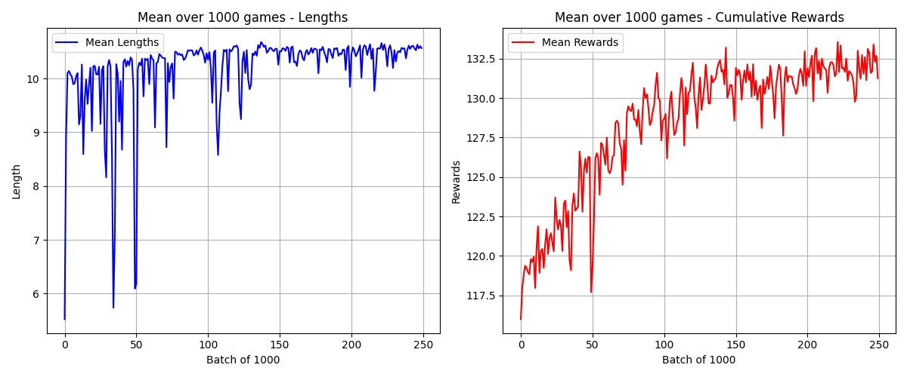
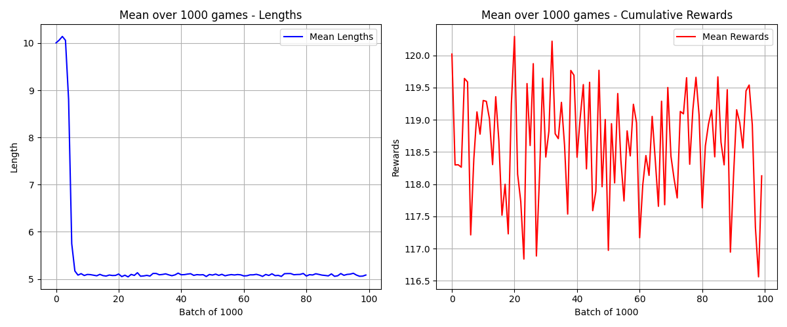
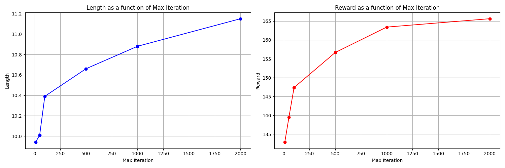
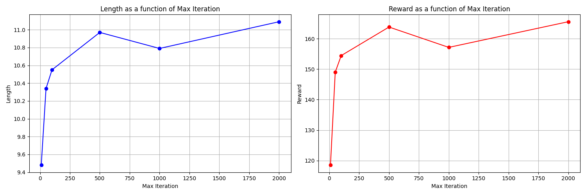

# Apprentissage par renforcement profond

## Introduction

Ce projet de groupe est la suite du projet sur l'apprentissage par renforcement.

Précédemment, nous pouvions apprendre la *policy* (stratégie) en stockant toutes les combinaisons d'états/actions, car notre environnement du Tic-Tac-Toe était relativement simple. Ici, nous allons nous intéresser au jeu [Balloon POP](https://fr.boardgamearena.com/gamepanel?game=balloonpop).

Dans des environnements plus complexes, le nombre d'états possibles peut rapidement exploser, rendant difficile à la fois le stockage de toutes les informations et l'exploration de ces états.

Pour pallier ce problème, nous remplaçons le stockage de tous les états possibles par un réseau de neurones, ce qui permet :

- D'estimer $Q(s,a)$ ou $\pi(a \mid s)$ avec une taille fixe définie à l'initialisation.
- De mieux généraliser : si notre modèle découvre un nouvel état, il pourra tout de même fournir une action basée sur son expérience.

Nous allons traiter trois catégories d'algorithmes :

### Modèles basés sur l'estimation de $Q(s,a)$

Ces modèles sont la suite logique des algorithmes vus précédemment comme *Q-learning*, mais utilisant un réseau de neurones pour estimer $Q(s,a)$ :

- **Deep Q-Learning**
- **Double Deep Q-Learning**
- **Double Deep Q-Learning avec Experience Replay**
- **Double Deep Q-Learning avec Prioritized Experience Replay**

### Modèles basés sur l'estimation de $\pi(a \mid s)$ (*policy gradient*)

Au lieu d'estimer $Q(s,a)$, ces modèles approximent directement $\pi(a \mid s)$. Cela permet d'obtenir un modèle qui ne joue pas toujours la même action pour un même état grâce à la distribution de probabilités, au lieu de toujours choisir la valeur maximale de $Q(s,a)$.

Cela favorise une exploration naturelle, mais ces algorithmes sont généralement plus longs et difficiles à entraîner car plus instables. La méthode *Actor-Critic* utilise aussi $V(s)$ pour tirer parti des avantages des modèles basés sur $Q(s,a)$.

- **REINFORCE**
- **REINFORCE avec *Mean Baseline***
- **REINFORCE avec *Baseline Learned by a Critic***
- **PPO A2C**

### Modèles basés sur l'apprentissage d'un arbre d'exploration

L'idée est de construire progressivement un arbre de recherche et d'évaluer les différentes branches pour prendre les meilleures décisions. Ces modèles peuvent être combinés avec des réseaux de neurones, donnant naissance aux célèbres algorithmes *AlphaZero* et *MuZero*.

- **Random Rollout**
- **Monte Carlo Tree Search (ISMCTS)**
- **Expert Apprentice** *(non implémenté)*
- **AlphaZero** *(non implémenté)*
- **MuZero** *(non implémenté)*
- **MuZero Stochastique** *(non implémenté)*

---

## Structure du projet

- `logs/{environnement}/{nom_modele}` : Contient les logs des durées et des récompenses cumulatives pour les différents environnements et modèles.
- `model/{nom_modele}` : Sauvegarde des modèles après entraînement pour leur réutilisation.
- `src/agent_env` : Contient les différents environnements.
- `src/DRL_algorithm` : Contient les différents algorithmes.
- `src/visualisation/log_analysis.py` : Script permettant l'affichage des logs sous forme de graphiques.

---

## Évaluation aléatoire

Afin de comparer les résultats des différents modèles sur le jeu *Balloon POP*, nous avons calculé le score moyen obtenu en effectuant uniquement des actions aléatoires.

Pour 1000 parties :
- **Score moyen** : environ 118
- **Nombre moyen d'actions pour terminer une partie** : environ 9,6

---

## Modèles basés sur l'estimation de $Q(s,a)$

Exemple de résultat pour l'algorithme **Double Deep Q-Learning**, une amélioration de *Deep Q-Learning*. Il utilise un second réseau pour estimer $Q(s,a)$ afin d'éviter le problème de surestimation. Le modèle a été entraîné sur 250 000 parties pour un temps total d'environ 20 minutes.

À gauche, le nombre d'actions par partie et, à droite, la récompense cumulée moyennée sur 1000 parties.

On observe que la durée d'une partie augmente légèrement et que la récompense cumulée commence à la valeur correspondant au hasard (environ 118), atteignant un score d'environ 132. Il semblerait que nous n'ayons pas atteint le seuil maximum et qu'avec plus d'entraînement, nous pourrions encore améliorer le score.

---

## Modèles basés sur l'estimation de $\pi(a \mid s)$

Exemple de résultat pour l'algorithme **REINFORCE avec *Baseline Learned by a Critic*** : en plus du calcul de la *policy*, nous calculons aussi $V(s)$ pour stabiliser l'apprentissage en comparant la récompense obtenue à celle attendue.

Nous constatons que l'apprentissage n'a pas fonctionné sur *Balloon POP*. La récompense cumulée n'augmente pas et reste au niveau du score obtenu avec un agent aléatoire. De plus, le nombre d'actions par partie a chuté de 10 à 5 et n'évolue plus, ce qui laisse supposer que le modèle est bloqué dans une stratégie sous-optimale.

Il faudrait essayer de diminuer le *learning rate* et d'augmenter le temps d'entraînement. Comme énoncé dans l'introduction, ces modèles sont difficiles à entraîner.

---

## Modèles basés sur l'apprentissage d'un arbre d'exploration

### **Random Rollout**

Cette approche consiste, à partir d'un état $s$ donné, à simuler *n* parties en effectuant des actions aléatoires, puis à moyenner les scores obtenus pour chaque action disponible depuis $s$. L'action choisie est celle ayant le plus haut score moyen.

Max iteration correspond au nombre de simulation effectuée et chaque score est moyenné sur 100 parties.

On observe des résultats bien meilleurs malgré la simplicité de l'algorithme. Toutefois, il semble tendre vers un seuil. *Balloon POP* reste un jeu relativement simple, donc *Random Rollout* est efficace, mais il le serait beaucoup moins sur un jeu plus complexe comme les échecs.

### **Monte Carlo Tree Search**

Cette approche est une évolution de *Random Rollout*. Elle permet d'orienter les recherches de manière plus intelligente et conserve en mémoire l'arbre d'exploration, ce qui permet une fois entrainer de le réutiliser pour obtenir l'action à la manière d'un réseau de neurones.

En augmentant le nombre de simulations, le score tend vers le même seuil qu'avec *Random Rollout*, mais avec moins de simulations nécessaires grâce à une exploration plus efficace.

